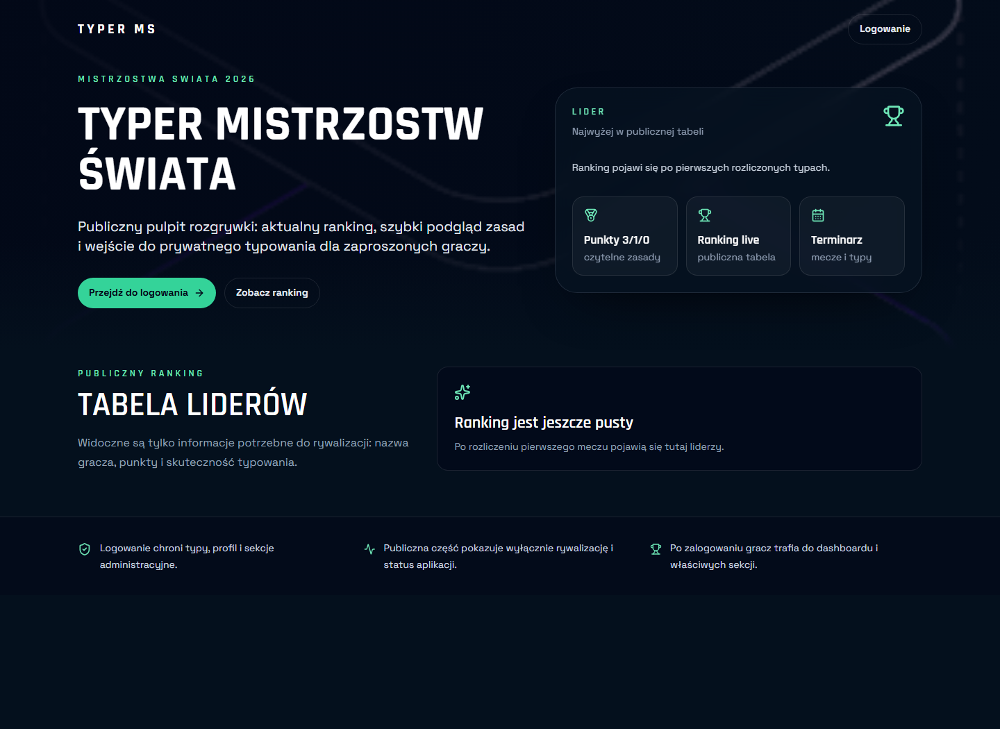
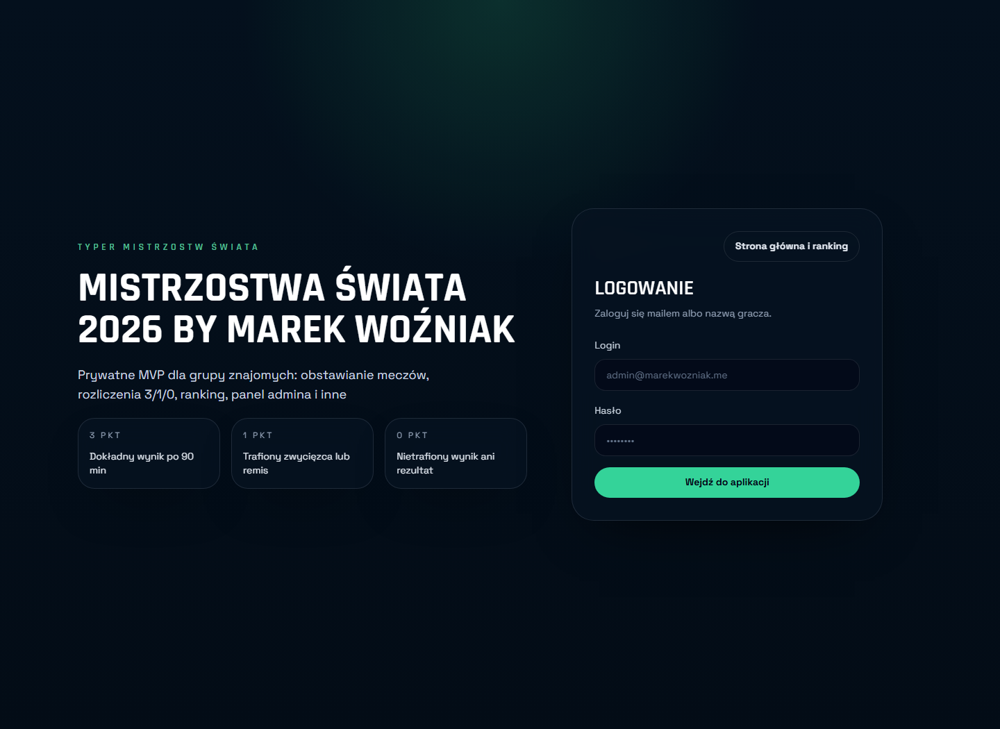
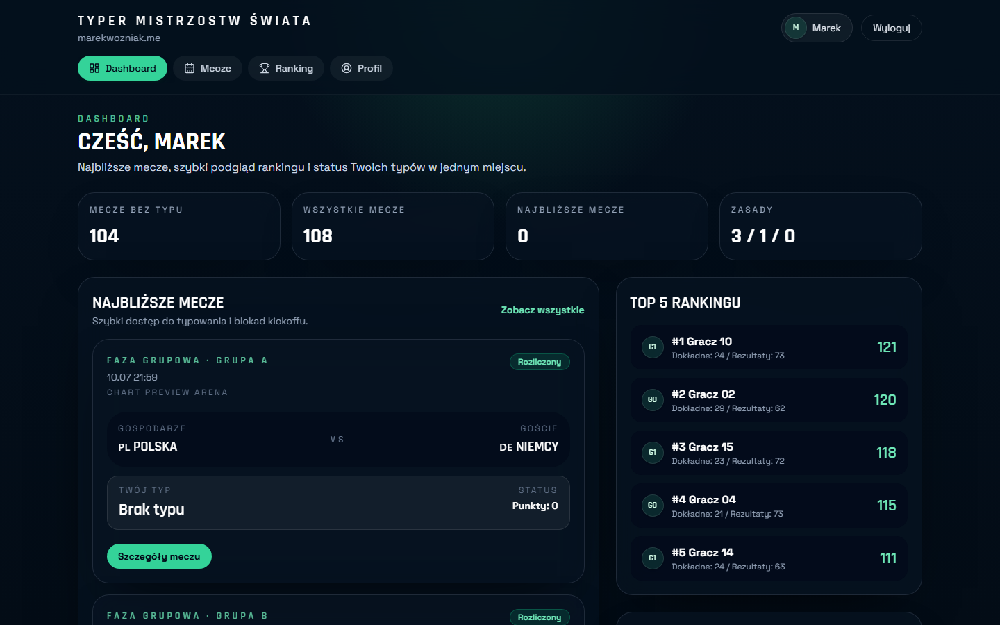
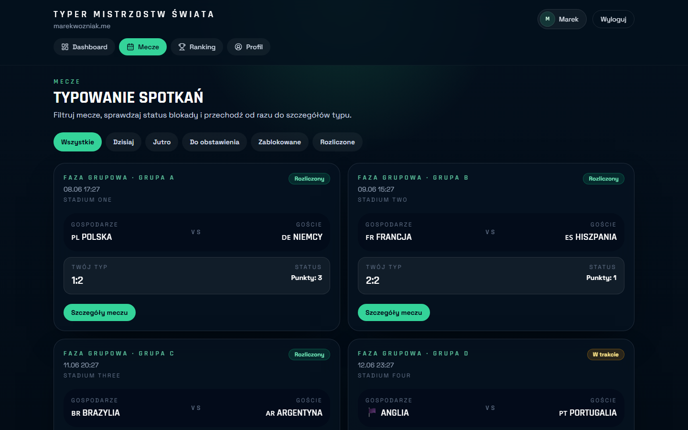
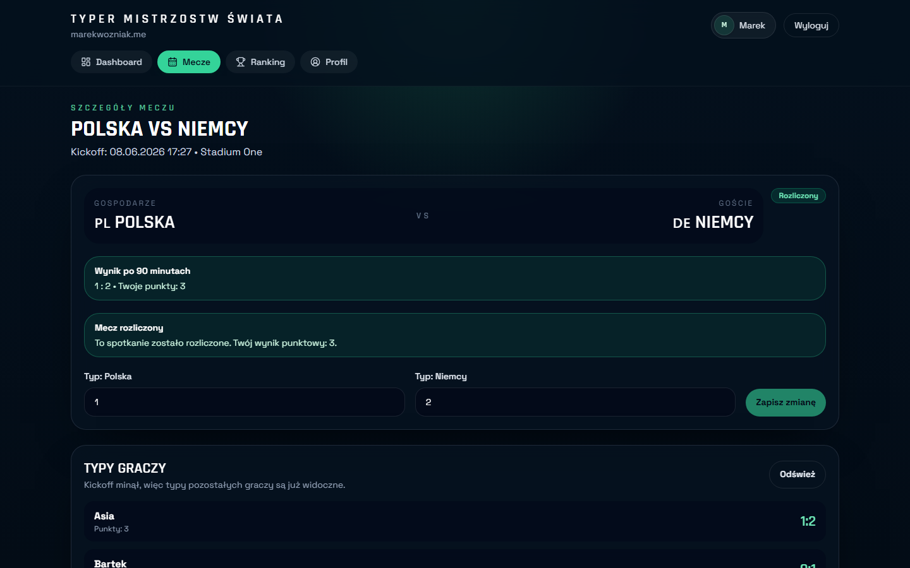
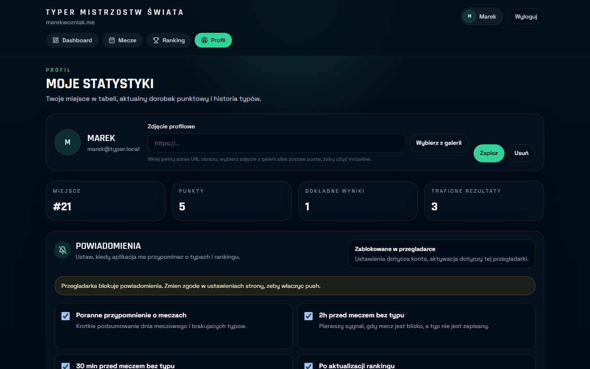
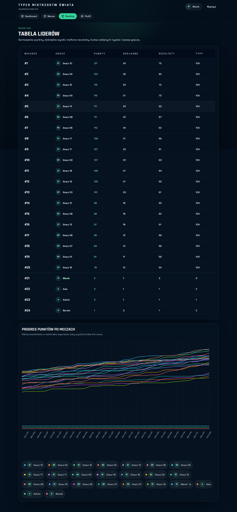
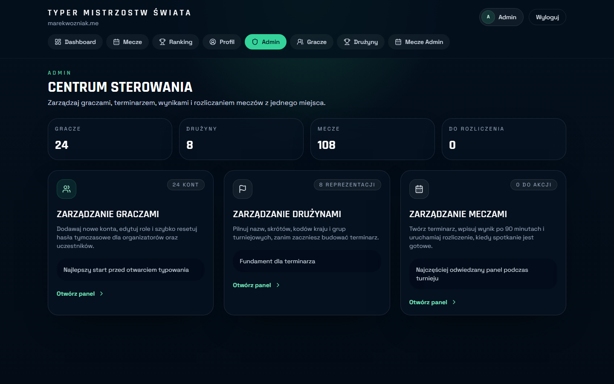

# World Cup Typer

Production-ready web application for running a private World Cup prediction league with friends.

The app covers the full tournament workflow: player accounts, match predictions, kickoff locks, result settlement, public ranking, admin operations, PWA support, web push reminders, and CI/CD deployment. It is built as a portfolio project, but it is also a real product deployed for a private group.

## Live

- Frontend: [typer.marekwozniak.me](https://typer.marekwozniak.me)
- Public access: landing page and top ranking
- Private access: predictions, profile, notifications, and admin panels require an invited account

## Screenshots

The screenshots below show the actual application UI. Player-facing and admin views were captured from a local instance running the development seed, so every name, email, and result is placeholder data — no real player information is published in the repository.

### Public

The unauthenticated surface: a landing page that pitches the league and links to login, plus the email/display-name login form.

| Public landing | Login |
| --- | --- |
|  |  |

Landing page with the public pitch and top-ranking teaser · JWT login by email or display name.

### Player experience

The core prediction loop: a dashboard that surfaces what needs attention, the match browser with kickoff-lock status, and the per-match prediction form.

| Dashboard | Match browser |
| --- | --- |
|  |  |

Dashboard with missing predictions, upcoming matches, top ranking, and scoring rules · Match list with phase/group filters, settlement badges, and per-match points.

| Match details & prediction | Profile |
| --- | --- |
|  |  |

Match detail view: prediction form, kickoff lock, settled result, and post-kickoff visibility of other players' predictions · Profile with stats, avatar management, password change, and notification preferences.

### Ranking

The full leaderboard with deterministic tie-breakers and a multi-player points-progress chart backed by leaderboard snapshots.



### Admin

The operator control center for players, teams, matches, results, settlement, ranking recalculation, and football-data sync.



## What It Does

World Cup Typer is a private PWA for predicting FIFA World Cup match results. Players submit scores before kickoff, the backend enforces prediction locks, and the system settles matches into a transparent `3/1/0` scoring model:

- `3 pts` for an exact score after 90 minutes
- `1 pt` for the correct outcome
- `0 pts` for a missed prediction

The app exposes a public competition surface while keeping the actual prediction workflow private.

## Product Highlights

- JWT login with `Admin` and `Player` roles.
- Required password-change flow for temporary passwords.
- Admin panel for players, teams, matches, results, settlement, ranking recalculation, and football-data sync.
- Match list, match details, prediction form, kickoff lock, and post-kickoff prediction visibility.
- Ranking with deterministic tie-breakers, avatars, current-user markers, and a progress chart backed by leaderboard snapshots.
- Player profile with prediction history, ranking progress, password change, avatar URL/gallery upload, stats, and notification preferences.
- PWA installation flow, app icons, service worker setup, and browser push notification support.
- Web push reminders for missing predictions, morning digests, ranking updates, and test notifications with idempotent delivery tracking.
- Schedule/result import through a `football-data.org` adapter, with optional automatic settlement.
- Mobile-first dark UI with responsive tables, cards, fixed mobile navigation, loading states, empty states, and error handling.

## Current Implementation

The repository currently includes the complete product flow, not just an MVP skeleton.

### Player Experience

- Public landing page with anonymous top-ranking data.
- Login by email or display name.
- Dashboard with missing predictions, upcoming matches, top ranking, and scoring rules.
- Match browsing with filters and match cards.
- Prediction creation and editing before kickoff.
- Locked post-kickoff state with delayed visibility of other players' predictions.
- Full ranking table and multi-player ranking progress chart.
- Profile page with current ranking, stats, progress history, prediction history, avatar management, password change, and notification settings.

### Admin Experience

- Player create/edit/deactivate flows.
- Temporary password reset with forced password change.
- Team create/edit flows with country metadata and group assignment.
- Match create/edit flows with phase, group, kickoff, venue, status, 90-minute score, final score, and settlement.
- Ranking recalculation for operational recovery.
- Manual football-data.org sync endpoint for schedule/result import.

### Automation And Background Work

- EF Core migrations can be applied at startup or through a manual migration workflow.
- `FootballDataSyncWorker` can import fixtures/results on a schedule.
- `NotificationReminderWorker` sends due push reminders.
- Web push delivery stores durable delivery records for diagnostics and deduplication.

## Architecture

The repository is a monorepo with a React frontend and a layered .NET backend.

```text
frontend/  React, Vite, TypeScript, Tailwind CSS, React Router, TanStack Query, PWA
backend/   .NET 8, ASP.NET Core Web API, EF Core, PostgreSQL, JWT, Web Push
docs/      Architecture, API contract, data model, deployment notes, product notes
```

Backend layers:

- `Domain` - entities, enums, and business concepts.
- `Application` - DTOs, service interfaces, and use-case services.
- `Infrastructure` - EF Core, PostgreSQL persistence, JWT, password hashing, football data import, notifications.
- `Api` - REST controllers, auth, middleware, CORS, health checks, and host configuration.
- `Tests` - unit and integration-style coverage for core domain rules.

Key design choices:

- Prediction rules are enforced in the backend, not only in the UI.
- Settlement is idempotent and produces leaderboard snapshots for historical ranking views.
- Push delivery uses durable records to deduplicate reminders and diagnose failed subscriptions.
- External integrations are behind interfaces so the core game logic stays testable.

## Tech Stack

| Area | Stack |
| --- | --- |
| Frontend | React, TypeScript, Vite, Tailwind CSS, React Router, TanStack Query, Recharts |
| Backend | .NET 8, ASP.NET Core Web API, EF Core, PostgreSQL |
| Auth | JWT, role-based authorization |
| PWA | Vite PWA, service worker, install prompt, Web Push |
| Integrations | football-data.org adapter, Web Push VAPID |
| Delivery | GitHub Actions, GitHub Pages, GHCR, DigitalOcean App Platform |
| QA | xUnit, Playwright smoke tests, Docker image build, health checks |

## Quality And Operations

The project includes automated checks and production-oriented workflows:

- CI builds and tests the backend.
- CI builds the frontend.
- Docker image build validates the API container.
- GitHub Pages workflow deploys the frontend.
- DigitalOcean App Platform workflow deploys the backend from a pinned image digest.
- Playwright smoke tests support production, staging, and local preview modes.
- Current repository test inventory: 87 backend test cases and 26 Playwright/helper tests.
- Health endpoints expose liveness and readiness checks:

```text
GET /health
GET /health/live
```

## Local Development

### Requirements

- .NET 8 SDK
- Node.js 20+
- Docker

### 1. Start PostgreSQL

```bash
docker compose up -d
```

### 2. Run Backend

```bash
cd backend
dotnet restore
dotnet build
dotnet test
dotnet tool restore
dotnet tool run dotnet-ef database update --project WorldCupTyper.Infrastructure --startup-project WorldCupTyper.Api
dotnet run --project WorldCupTyper.Api
```

The API starts at:

```text
http://localhost:5000
```

### 3. Run Frontend

```bash
cd frontend
npm install
copy ..\.env.example .env
npm run dev
```

The frontend expects:

```text
VITE_API_BASE_URL=http://localhost:5000
```

Local CORS allows both:

```text
http://localhost:5173
http://127.0.0.1:5173
```

## Development Seed

Development-only accounts are seeded for local testing:

```text
Admin:  admin@marekwozniak.me / ChangeMe123!
Players: marek@typer.local, kuba@typer.local, bartek@typer.local, pawel@typer.local, asia@typer.local
Password: ChangeMe123!
```

These credentials are not production credentials. Production configuration is provided through environment variables and secrets.

## Useful Commands

Backend:

```bash
dotnet test backend/WorldCupTyper.sln --configuration Release
docker build -f backend/WorldCupTyper.Api/Dockerfile -t world-cup-typer-api .
```

Frontend:

```bash
cd frontend
npm run build
npm run build:pages
npm run lint
npm run test:e2e:smoke
```

## Documentation

- [Architecture](docs/architecture.md)
- [API contract](docs/api-contract.md)
- [Data model](docs/database-model.md)
- [Local development](docs/local-development.md)
- [Deployment preparation](docs/deployment-prep.md)
- [Production backups](docs/production-backups.md)
- [Web push notifications](docs/web-push-notifications.md)
- [Football API research](docs/football-api-research.md)
- [Project status](docs/mvp-status.md)

## Project Status

The original MVP scope is complete. Current documentation tracks the implemented system rather than a future checklist:

- [Project status](docs/mvp-status.md)
- [API contract](docs/api-contract.md)
- [Data model](docs/database-model.md)
- [Architecture](docs/architecture.md)

Remaining work is optional product evolution, such as richer social features, non-stub knockout resolution, email/OAuth account flows, and deeper production observability.
